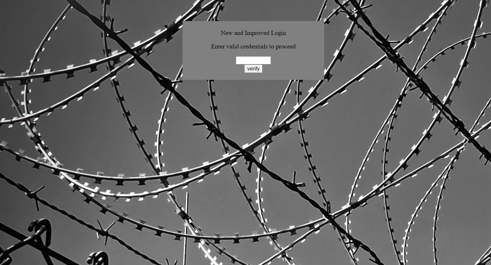

The initial website contains a single form that verifies whether the entered credentials are correct.



Upon inspecting the source code, we find a JavaScript section:

```javascript
var _0x5a46 = ['0a029}', '_again_5', 'this', 'Password Verified', 'Incorrect password', 'getElementById', 'value', 'substring', 'picoCTF{', 'not_this'];
(function (_0x4bd822, _0x2bd6f7) {
    var _0xb4bdb3 = function (_0x1d68f6) {
        while (--_0x1d68f6) {
            _0x4bd822['push'](_0x4bd822['shift']());
        }
    };
    _0xb4bdb3(++_0x2bd6f7);
}(_0x5a46, 0x1b));

var _0x4b5b = function (_0x2d8f05, _0x4b81bb) {
    _0x2d8f05 = _0x2d8f05 - 0x0;
    var _0x4d74cb = _0x5a46[_0x2d8f05];
    return _0x4d74cb;
};

function verify() {
    checkpass = document[_0x4b5b('0x0')]('pass')[_0x4b5b('0x1')];
    split = 0x4;
    if (checkpass[_0x4b5b('0x2')](0x0, split * 0x2) == _0x4b5b('0x3')) {
        if (checkpass[_0x4b5b('0x2')](0x7, 0x9) == '{n') {
            if (checkpass[_0x4b5b('0x2')](split * 0x2, split * 0x2 * 0x2) == _0x4b5b('0x4')) {
                if (checkpass[_0x4b5b('0x2')](0x3, 0x6) == 'oCT') {
                    if (checkpass[_0x4b5b('0x2')](split * 0x3 * 0x2, split * 0x4 * 0x2) == _0x4b5b('0x5')) {
                        if (checkpass['substring'](0x6, 0xb) == 'F{not') {
                            if (checkpass[_0x4b5b('0x2')](split * 0x2 * 0x2, split * 0x3 * 0x2) == _0x4b5b('0x6')) {
                                if (checkpass[_0x4b5b('0x2')](0xc, 0x10) == _0x4b5b('0x7')) {
                                    alert(_0x4b5b('0x8'));
                                }
                            }
                        }
                    }
                }
            }
        }
    } else {
        alert(_0x4b5b('0x9'));
    }
}
```

The code includes a function named `verify`, which we need to analyze.

### Analyzing the `_0x4b5b` Function
First, let's examine the `_0x4b5b` function:

```javascript
var _0x4b5b = function (_0x2d8f05, _0x4b81bb) {
    _0x2d8f05 = _0x2d8f05 - 0x0;
    var _0x4d74cb = _0x5a46[_0x2d8f05];
    return _0x4d74cb;
};
```

This function is simple. It takes two parameters (the second one is unused), subtracts `0x0` from the first parameter, and returns the value from the `_0x5a46` array at the resulting index.

We can test this function using browser developer tools. For example:
```javascript
_0x4b5b(0x1); // Returns 'value'
```

This pattern continues for other inputs.

### Simplifying the `verify` Function
To improve readability, let's replace `_0x4b5b` with `fnc` and simplify the `verify` function by replacing
hexadecimal values with decimal:

```javascript
function verify() {
    checkpass = document[fnc('0x0')]('pass')[fnc('0x1')];
    split = 4;
    if (checkpass[fnc('0x2')](0, split * 2) == 'picoCTF{') {
        if (checkpass[fnc('0x2')](7, 9) == '{n') {
            if (checkpass[fnc('0x2')](8, 16) == 'not_this') {
                if (checkpass[fnc('0x2')](3, 6) == 'oCT') {
                    if (checkpass[fnc('0x2')](split * 3 * 2, split * 4 * 2) == '0a029}') {
                        if (checkpass['substring'](6, 11) == 'F{not') {
                            if (checkpass[fnc('0x2')](split * 2 * 2, split * 3 * 2) == '_again_5') {
                                if (checkpass[fnc('0x2')](12, 16) == 'this') {
                                    alert('Password Verified');
                                }
                            }
                        }
                    }
                }
            }
        }
    } else {
        alert('Incorrect password');
    }
}
```

### Decoding the Password
From the conditions in the `verify` function, we can deduce the structure of the password. For example:
- The substring from index `0` to `8` must be `picoCTF{`.
- The substring from index `7` to `9` must be `{n`.
- The substring from index `8` to `16` must be `not_this`.
- And so on.

By piecing together these conditions, we can reconstruct the flag:
```
picoCTF{not_this_again_50a029}
```
