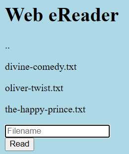

## Problem
`
We know that the website files live in /usr/share/nginx/html/ and the flag is at /flag.txt but the website is filtering absolute file paths. Can you get past the filter to read the flag?
`
And website has just a 1 input field for text.



## Exploit
Since we cannot use absolute path, lets use relative one
Now we are in /usr/share/nginx/html/<us>

We can get into previous directory by using `..`

And we are 4 directories deep, then we can use `../` four times

```bash
../../../../flag.txt
```
