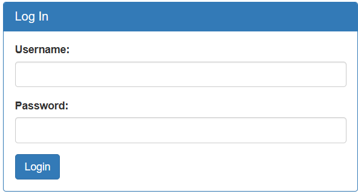

The page we have to exploit is just a static site with photos of Irish people.  



Menu in the top left, gives us a option for admin login.


This form seems like a possible sql injection.


If we inspect the html code of this site, we can find that there is hidden 'debug' element with boolean value.
```html
<input type="hidden" name="debug" value="0">
```

If we overwrite the boolean value and select `login`, the page we are redirected to will give us debugging information - used username, used password and SQL query the web application has tried to use. 

```
username: test
password: 
SQL query: SELECT * FROM users WHERE name='test' AND password=''
```

Now we know for sure, that the solution to this CTF is a SQL injection.
Used SQL query uses name as the first query parameter, so we can input 
```
' OR 1=1 --
```  

- `'` ends the name parameter
- `OR 1=1` gives us a boolean that is always true, making it so previous condition is also always true
- `--` comments out the rest of the query

This will log us in and give us the flag!

