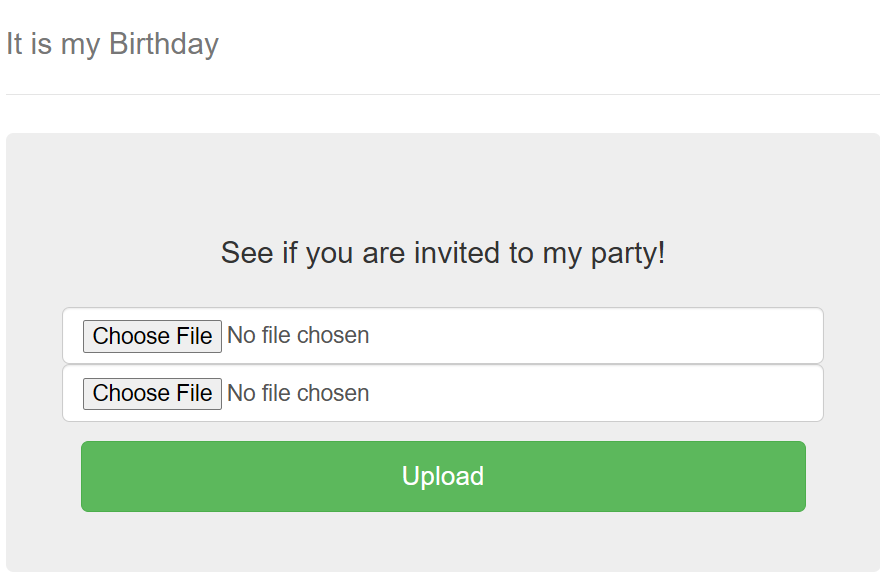

The whole website is just 2 file inputs. In challenge description it says, that it will check using if those 2 files are .pdf and have the same MD5 hash and let us in if they do.

After little bit of googling i have found this beautiful github repo - `https://github.com/corkami/collisions/blob/master/examples/free/`
which exactly has 2 `pdf` files with same md5 hash.

And clicking `Upload` lets us in, shows us the source code for this page and has the flag commented out! 
