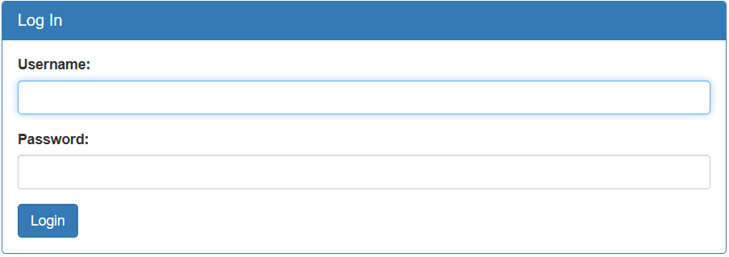
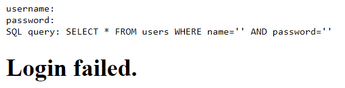

Simple page that wants us to try SQL Injection.



If we press `Login`, it redirects us to this.



This gives us information on SQL query that is used.

Now we know for sure, that the solution to this CTF is a SQL injection.
Used SQL query uses name as the first query parameter, so we can input 
```
' OR 1=1 --
```  

- `'` ends the name parameter
- `OR 1=1` gives us a boolean that is always true, making it so previous condition is also always true
- `--` comments out the rest of the query

This will log us in and give us the flag!
