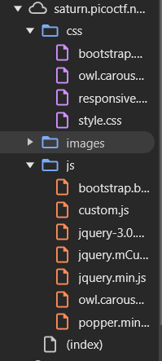

The initial website is a complex, dynamic site with multiple links.


Given that the challenge is named **"Search source"**, it is reasonable to assume that the solution involves searching through the source code. After inspecting the website, we can see that there is a lot of source files.



Manually browsing through all these files would be really time-consuming, so instead, we can download all the source files using `wget`:

```bash
wget -mpEk http://saturn.picoctf.net:<PORT>
```

Once the files are downloaded, we can use `grep` to search for the flag:

```bash
grep -r 'picoCTF{' .
```

This command will recursively search through all the downloaded files for the flag pattern `picoCTF{`.