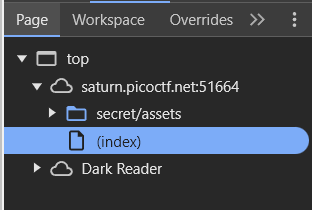

This challenge begins in a static site. If we inspect the sources, we can see that there is a another folder `secret` that has some `assets`

So to our URL `http://saturn.picoctf.net:PORT/` we can concatenate the `secret/`

This will get us to `http://saturn.picoctf.net:PORT/secret/`

We can inspect it again to see that there is another folder called `hidden`.

We can concatenate our URL again to get `http://saturn.picoctf.net:PORT/secret/hidden`.

This will redirect us to a with a login form, which is most likely just a way to mess with us, because if we inspect the website again, we will see that there is another folder called `superhidden`.
  

We can concatenate our URL again to get `http://saturn.picoctf.net:PORT/secret/superhidden`.

This time the website tells us that this is the final subfolder, but there is no flag.
If we inspect the site, we can see that the element has just the same color as the background, but via inspection tool we can see him.

