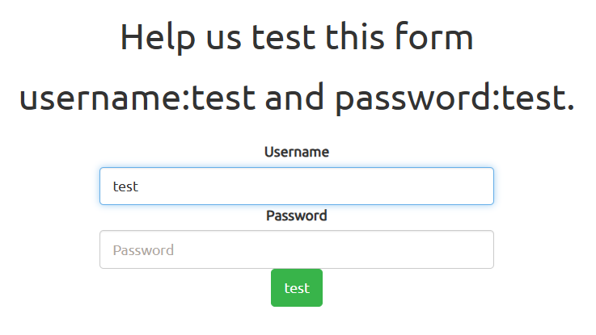
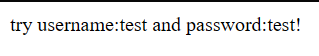
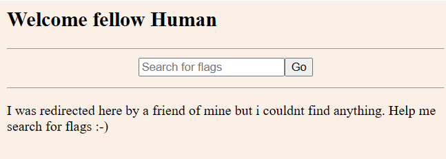
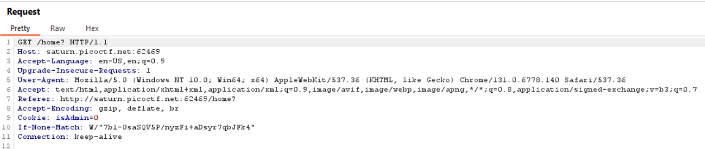
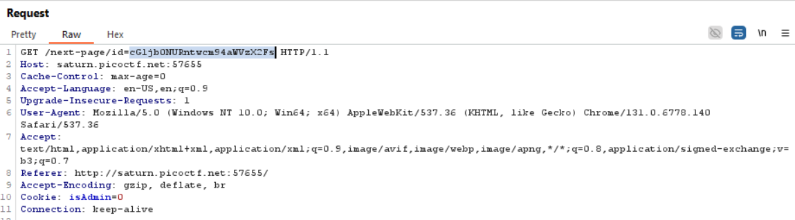
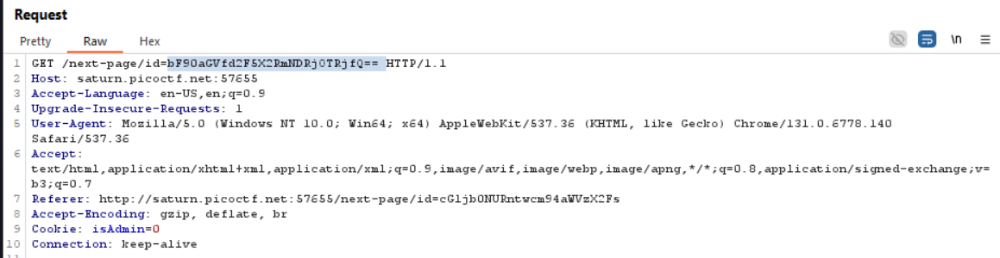

The website features only two input fields and provides hints for the correct input.

When attempting to use `test` for both inputs, the site redirects to a new page instructing us to add an exclamation mark to the end of the password.

After following the hint and trying `test` and `test!`, we are redirected to another page with an input field that appears to be non-functional.

Since the source code does not reveal anything noteworthy, the next logical step is to use Burp Suite for further analysis.

We know that the page uses HTTP `GET` requests.

Starting from the original login page, we input the credentials `test` and `test!`, then initiate an intercept in Burp Suite. This reveals three distinct `GET` requests. While the first request is unremarkable, the subsequent two contain a `GET` parameter named `id`.

By combining these two `id` values and decoding them using Base64, we obtain the final solution.
