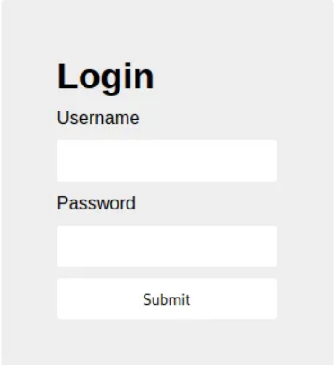

Classic login site, using invalid credentials gives us alert.  


After inspecting the site and checking `index.js`, we can see this code:

```Javascript
(async () => {
    await new Promise((e => window.addEventListener("load", e))),
    document.querySelector("form").addEventListener("submit", (e => {
        e.preventDefault();
        const r = {
            u: "input[name=username]",
            p: "input[name=password]"
        }
          , t = {};
        for (const e in r)
            t[e] = btoa(document.querySelector(r[e]).value).replace(/=/g, "");
        return "YWRtaW4" !== t.u ? alert("Incorrect Username") : "cGljb0NURns1M3J2M3JfNTNydjNyXzUzcnYzcl81M3J2M3JfNTNydjNyfQ" !== t.p ? alert("Incorrect Password") : void alert(`Correct Password! Your flag is ${atob(t.p)}.`)
    }
    ))
}
)();
```

At the bottom, we can see call of `btoa` function, which creates base64 from binary string. If we decode the base64 strings, we get `admin` from `YWRtaW4` and decoding `cGljb0NURns1M3J2M3JfNTNydjNyXzUzcnYzcl81M3J2M3JfNTNydjNyfQ` gives us flag of this challenge.