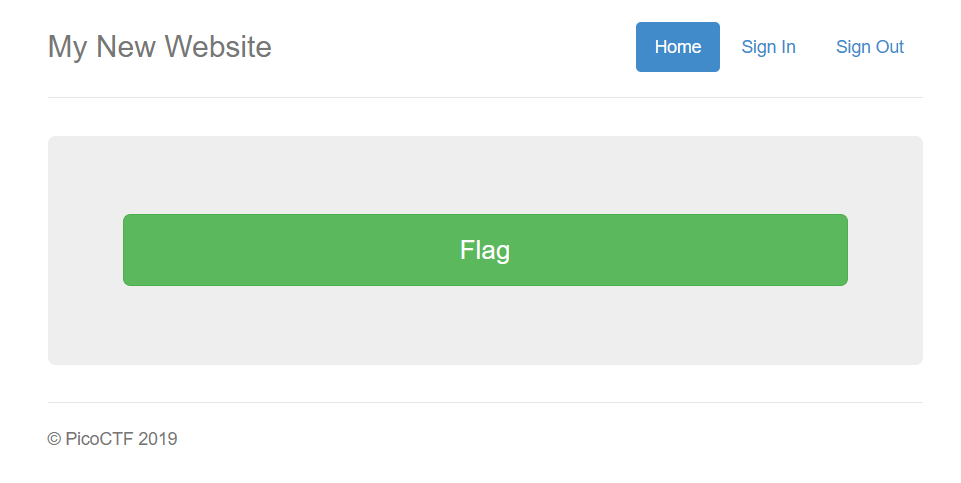
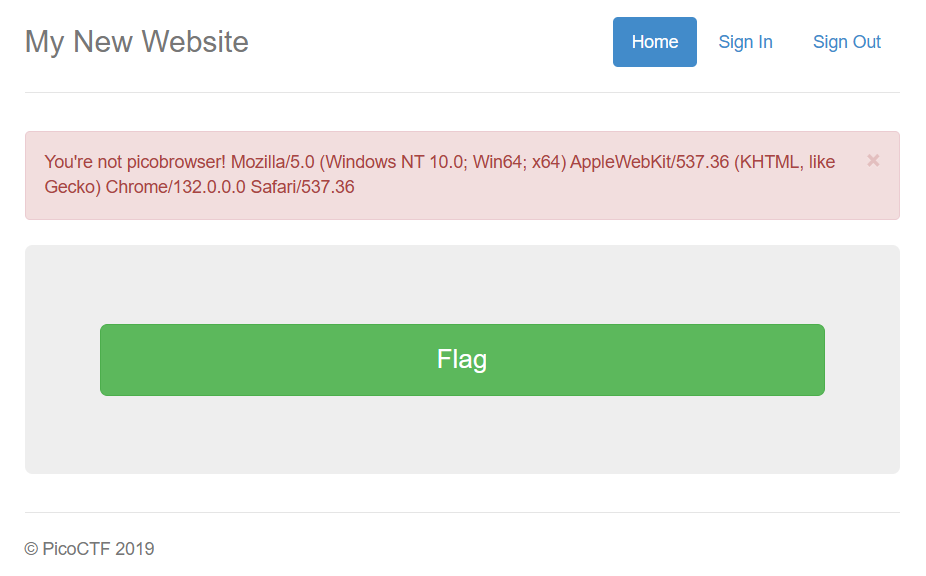
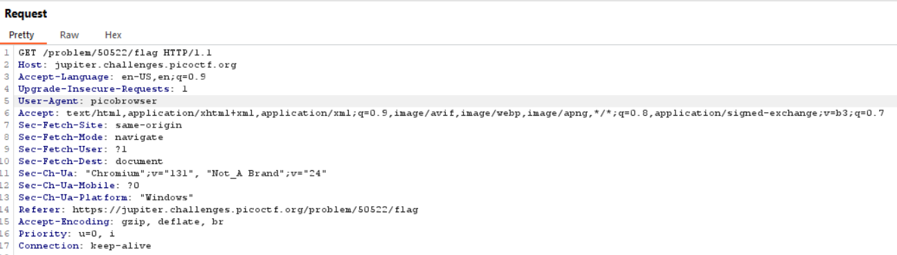
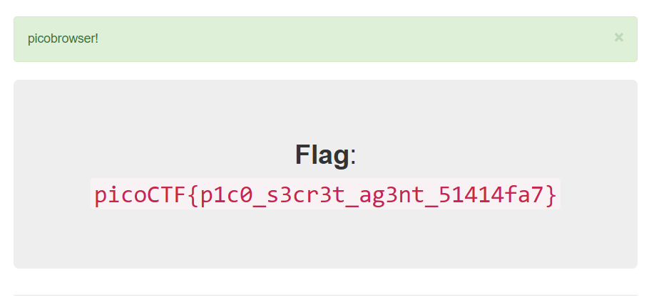

The challenge description mentions that the flag can only be viewed if we use **`picobrowser`**. Since I don’t have access to such a browser, I decided to proceed without this information and explore the website directly.

The site is minimalistic, featuring only a single button that supposedly reveals the flag.

However, clicking the button results in a red warning message and no flag.

To investigate further, I launched **Burp Suite**, enabled interception, and navigated to the site. Several `GET` requests were captured, but one stood out: the request to `/problem/50522/flag`.

The key to solving this challenge lies in modifying the `User-Agent` header in the request. By changing the `User-Agent` to `picobrowser`, we can trick the server into thinking we are using the required browser.

Here’s how it’s done:

1. Intercept the request to `/problem/50522/flag` in Burp Suite.
2. Modify the `User-Agent` header to `picobrowser`.

After forwarding the modified request, the server responds with the flag.

This demonstrates how altering the `User-Agent` header can bypass restrictions and reveal the hidden flag.